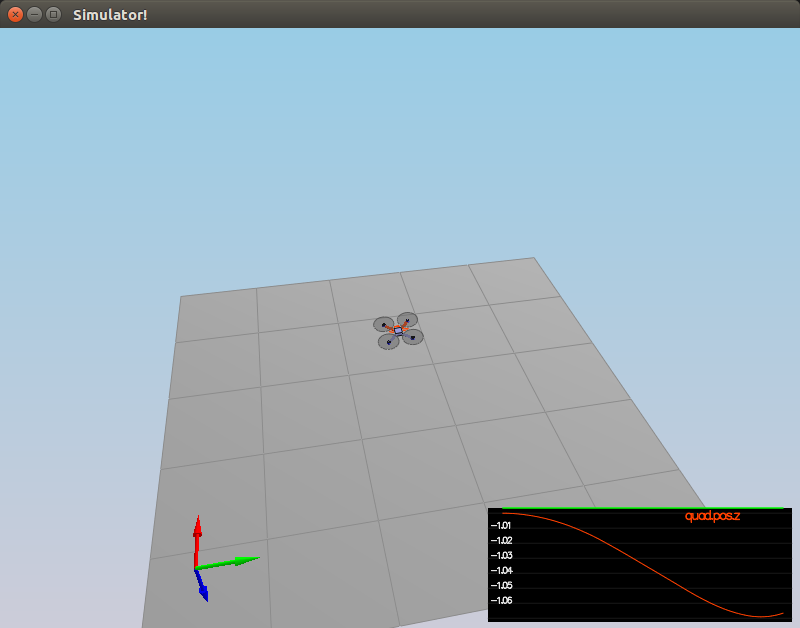
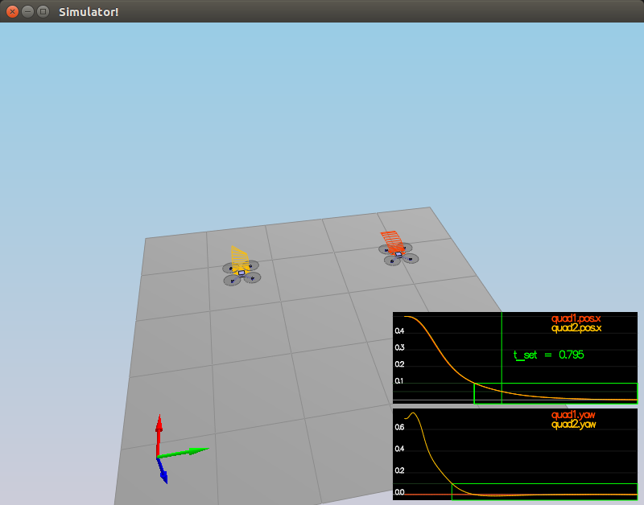
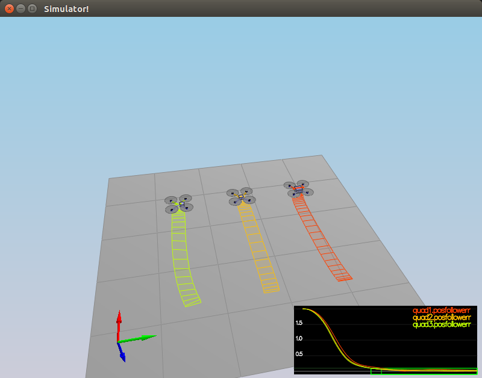
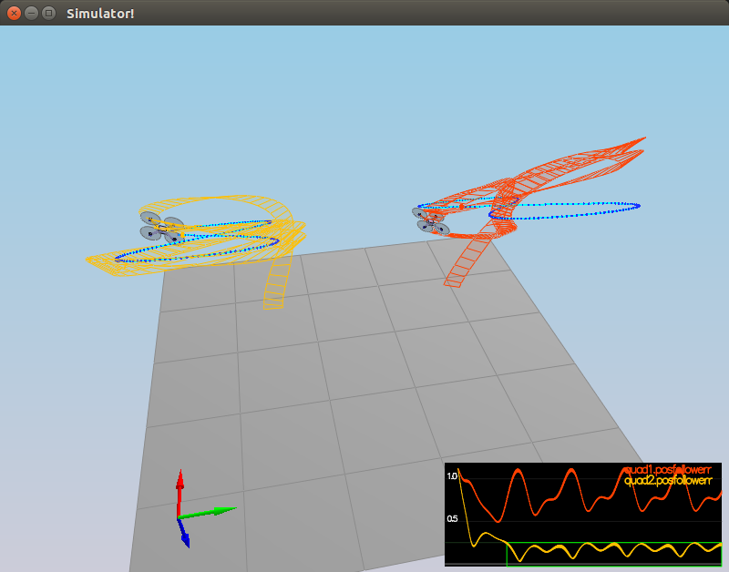

# Building a Controller

## Code Descriptions ##

### Imlement Body Rate Controller ###

The body rate controller was implemented in `BodyRateControl()` in lines 125-128. It is a simple proportional controller, multiplying the (proportional) gain parameter vector (with individual terms for each of the three axes) by the moment of inertia vector by the body rate error vector.

### Implement Roll-Pitch Controller ###

In lines 159-186, in the `RollPitchControl()` function, the proportional controller(s) for roll and pitch was implemented. The controller is basically modeled on `Equation 6` of `Feed-Forward Parameter Identification for Precise Periodic Quadrocopter Motions`. It is easily ported from the Python controller code provided at: https://github.com/udacity/FCND-Controls/blob/solution/controller.py.

### Implement Altitude Controller ###

The altitude controller was implemented in lines 218-238 of `AltitudeControl()` and was a full proportional–integral–derivative controller (with the integrator needed for non-idealities introduced in Scenario 4). A PD-controller analogue can be found in `solution.py` for the `Exercise 5.3` of the `3D Drone` notebook for `Lesson 4: Full 3D Control`.

### Implement Lateral Position Controller ###

In lines 276-288, a proportional-deriative controller incorporating feed-forward control is implemented in `LateralPositionControl()`. This is also is easily ported from the Python controller code provided at: https://github.com/udacity/FCND-Controls/blob/solution/controller.py.

### Implement Yaw Controller ###

The yaw controller, like body rate controller, is a simple proportional controller (this time in one dimension) and was implemented in `YawControl()` in lines 312-313.

### Implement Motor Commands ###

In lines 73-100 of `GenerateMotorCommands()`, generation of thrust values for each rotor was implemented. A set of equations similar to those presented in `Exercise 1.1` of the `3D Drone` notebook for `Lesson 4: Full 3D Control` was used; however, instead of solving for angular velocities (rotation rates), the form of equations pertaining to force were used. Identifying the inverse matrix allowed for solution for each of the rotors, as described by the comments accompanying the code.

## Screenshots ##

### Scenario 1 ###

### Scenario 2 ###

### Scenario 3 ###

### Scenario 4 ###

### Scenario 5 ###

